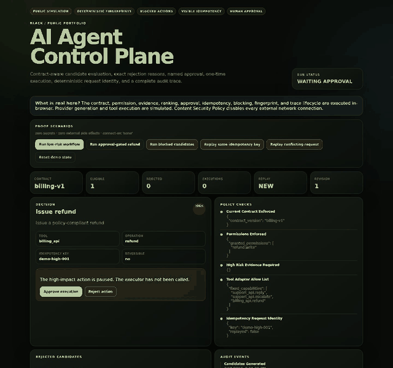

# AI Agent Control Plane

[](https://github.com/o-yutaka/AI-AI/actions/workflows/ci.yml)
[](https://github.com/o-yutaka/AI-AI/actions/workflows/generate-proof-assets.yml)
[](https://raw.githack.com/o-yutaka/AI-AI/main/docs/live-demo.html)
[](LICENSE)

A full-stack reference system for **contract-aware, auditable, human-approved AI agents**.

**Live interactive proof:** <https://raw.githack.com/o-yutaka/AI-AI/main/docs/live-demo.html>

> Public simulation: the contract, permission, evidence, ranking, approval, blocking, idempotency, fingerprint, and audit lifecycle execute in the browser. Provider generation and tool execution are simulated, and Content Security Policy disables external network calls. The repository separately contains the real OpenAI-compatible provider and fixed HTTP tool adapter implementations.

[](https://raw.githack.com/o-yutaka/AI-AI/main/docs/live-demo.html)

## Verified browser proof

The proof workflow launches Chromium, operates the public demo, asserts its state transitions, and generates the committed screenshots and GIF. The machine-readable result is [`docs/assets/proof/visual-proof-manifest.json`](docs/assets/proof/visual-proof-manifest.json).

| Property | Verified result |
|---|---:|
| Same canonical input, different run IDs | same request fingerprint |
| Duplicate idempotency request | execution count `1` |
| Contract/permission/evidence/tool violations | blocked, execution count `0` |
| Conflicting request with the same key | rejected, execution count `0` |
| High-impact action before approval | execution count `0` |
| High-impact action after approval | execution count `1` |

Visual evidence:

- [Desktop — waiting approval, 1440 px](docs/assets/proof/ai-agent-control-plane-desktop-waiting.jpg)
- [Desktop — approved, 1440 px](docs/assets/proof/ai-agent-control-plane-desktop-approved.jpg)
- [Desktop — blocked candidates, 1440 px](docs/assets/proof/ai-agent-control-plane-desktop-blocked.jpg)
- [Desktop — idempotency replay, 1440 px](docs/assets/proof/ai-agent-control-plane-desktop-idempotency.jpg)
- [Mobile — waiting approval, 390 px](docs/assets/proof/ai-agent-control-plane-mobile-waiting.jpg)

## What the system proves

| Concern | Implemented evidence |
|---|---|
| LLM integration | OpenAI-compatible `/chat/completions` candidate planner |
| Model authority | Provider proposes candidates; runtime remains the only decision and execution authority |
| Current action boundary | Versioned action contract plus exact action allow-list |
| Tool boundary | Operator-configured host, method, path template, operation, timeout, and response limit |
| Invalid action refusal | Contract, permission, evidence, sensitive-payload, and tool-capability rejection reasons |
| Human control | Named approval or rejection before high-impact execution |
| Duplicate protection | Stable idempotency key, request fingerprint, replay proof, and conflict rejection |
| Decision identity | Canonical SHA-256 observation and request fingerprints independent of run ID |
| Privacy boundary | Recursive sensitive-key/free-text detection and redaction before provider transmission, persistence, API response, and error recording |
| Secret handling | Sensitive HTTP headers must reference environment variables; literal credentials are rejected |
| Network failure control | Redirects disabled and provider/tool responses stopped while streaming at configured byte limits |
| Durable state | SQLite repository preserves runs, approvals, fingerprints, and idempotency records across restart |
| Operations UI | Next.js dashboard for run, block, review, approve/reject, replay, result, and trace inspection |
| Reproducibility | npm, Python development, and Python runtime lockfiles; CI on Python 3.11/3.12; Docker builds and Compose smoke |

## Try every public scenario

1. Run the low-risk workflow.
2. Replay the same idempotency key and verify `REUSED` with execution count `1`.
3. Replay a conflicting request and inspect `IdempotencyConflictError`.
4. Run blocked candidates and inspect the exact four rejection classes.
5. Run the approval-gated refund and verify execution count `0`.
6. Approve or reject it and inspect the revised audit events.

The public mirror contains no secret and creates no external side effect.

## Architecture

```text
Next.js Operations Dashboard / API caller
                    |
                 FastAPI
                    |
   OpenAI-compatible Candidate Planner
      untrusted candidates, bounded stream
                    |
              Agent Runtime
       +------------+-------------+
       |            |             |
   Contract     Permission     Evidence
   allow-list     checks         checks
       |            |             |
       +----- sensitive-data gate
                    |
        deterministic ranking
                    |
       approval / rejection gate
                    |
          ToolRegistryExecutor
                    |
 fixed host + method + path + operation
 env-only secrets + no redirects + byte limit
                    |
       redacted result / structured error
                    |
          SQLite RunRepository
      audit events + fingerprints + replay
```

Two boundaries are non-negotiable:

1. Provider output is untrusted input. It must pass every runtime gate before execution.
2. The model cannot choose a host, HTTP method, arbitrary path, redirect target, or credential.

Design records:

- [`docs/adr/0001-durable-run-store.md`](docs/adr/0001-durable-run-store.md)
- [`docs/adr/0002-provider-tool-boundary.md`](docs/adr/0002-provider-tool-boundary.md)
- [`docs/adr/0003-data-boundary-and-streaming-limits.md`](docs/adr/0003-data-boundary-and-streaming-limits.md)

## Run the complete stack

```bash
docker compose up --build
```

Open:

- Dashboard: `http://localhost:3000`
- FastAPI/OpenAPI: `http://localhost:8000/docs`
- Health: `http://localhost:8000/health`

Compose uses non-root images, read-only filesystems, `no-new-privileges`, health-gated startup, a writable SQLite volume, and temporary `/tmp` filesystems.

## Locked local development

Python:

```bash
python -m venv .venv
source .venv/bin/activate
pip install -r requirements.lock.txt
pip install --no-deps -e .
ruff check .
pytest -q
uvicorn app:app --reload
```

PowerShell:

```powershell
py -m venv .venv
.\.venv\Scripts\Activate.ps1
pip install -r requirements.lock.txt
pip install --no-deps -e .
ruff check .
pytest -q
uvicorn app:app --reload
```

Frontend:

```bash
cd web
npm ci
npm run dev
```

## OpenAI-compatible planner

Copy the secret-free template and configure an endpoint implementing the OpenAI-style chat-completions shape:

```bash
cp .env.example .env
export OPENAI_COMPATIBLE_BASE_URL="https://provider.example/v1"
export OPENAI_COMPATIBLE_MODEL="your-model"
export OPENAI_COMPATIBLE_API_KEY="your-key"
export OPENAI_COMPATIBLE_MAX_RESPONSE_BYTES="524288"
```

Provider status:

```bash
curl http://localhost:8000/v1/provider
```

`POST /v1/agent-runs` redacts sensitive observation text before provider transmission, validates the returned `CandidateAction` objects, rejects undeclared tool operations, and then runs the same policy and idempotency gates as caller-supplied candidates.

## Real HTTP tool adapter

Adapters are configured by the operator, never generated by the model:

```json
{
  "support_api": {
    "base_url": "https://api.example.com",
    "headers": {
      "Authorization": "Bearer ${SUPPORT_API_TOKEN}"
    },
    "timeout_seconds": 20,
    "max_response_bytes": 262144,
    "operations": {
      "reply": {
        "method": "POST",
        "path": "/tickets/{ticket_id}/reply",
        "payload_mode": "json"
      }
    }
  }
}
```

The adapter rejects literal sensitive headers, missing environment variables, arbitrary hosts, redirects, unregistered operations, traversal paths, sensitive action payloads, oversized streaming responses, and malformed JSON responses.

## API

```text
GET  /health
GET  /v1/provider
POST /v1/agent-runs
POST /v1/runs
GET  /v1/runs
GET  /v1/runs/{run_id}
POST /v1/runs/{run_id}/decision
```

Examples:

```bash
curl -X POST http://localhost:8000/v1/runs \
  -H "Content-Type: application/json" \
  --data @examples/low-risk-run.json

curl -X POST http://localhost:8000/v1/runs \
  -H "Content-Type: application/json" \
  --data @examples/high-risk-run.json
```

## Verification gates

GitHub Actions verifies:

- Ruff and pytest on Python 3.11 and 3.12
- canonical fingerprint stability and changed-input sensitivity
- contract, permission, evidence, sensitive-data, and tool-capability blocking
- approval, rejection, execution count, idempotent replay, and conflict behavior
- provider-side privacy redaction and undeclared tool rejection
- streaming byte limits for provider and tool responses
- environment-only sensitive HTTP headers
- SQLite restart-safe approval and idempotency
- Next.js production/static export from `package-lock.json`
- backend and frontend images from committed runtime lockfiles
- Compose health and dashboard smoke
- Chromium interaction proof plus desktop/mobile/GIF generation

## Claim boundary

This is a portfolio-grade, durable single-node reference system. It does **not** claim:

- production authentication, tenant isolation, or enterprise RBAC
- distributed queues, multi-region replication, or distributed transactions
- audited regulatory compliance
- production traffic, customer deployments, SLOs, or load-test evidence
- bundled vendor-specific CRM, billing, email, or RAG connectors

See [`docs/evidence.md`](docs/evidence.md), [`docs/portfolio-audit-2026-08-01.md`](docs/portfolio-audit-2026-08-01.md), and [`SECURITY.md`](SECURITY.md).

## Deployment truth

The immediate mirror is verified by the deployment workflow and recorded in [`docs/live-status.json`](docs/live-status.json). The clean GitHub Pages URL is prepared at `https://o-yutaka.github.io/AI-AI/`, but it is not described as live until repository-level Pages is enabled and the status file records HTTP 200.

## License

MIT — see [`LICENSE`](LICENSE).
